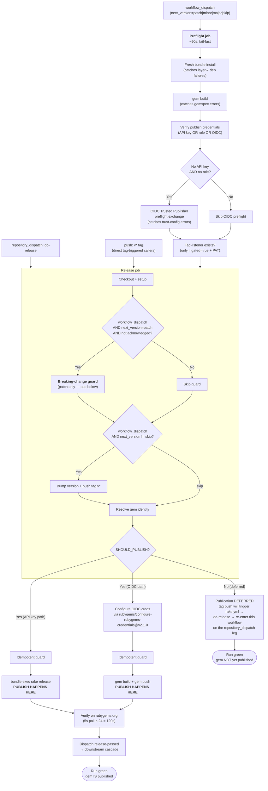

# rubygems-release.yml

Reusable workflow for building and publishing a single Ruby gem to RubyGems.org.

For the per-layer maintainer reference (failure modes, recovery playbooks, half-released states), see [`../release-chain.md`](../release-chain.md). This doc is the per-input/per-behavior reference for a caller wiring up `release.yml` in a gem repo.

## When does the gem actually get published?

**Publication is conditional.** A green workflow run does NOT always mean the gem is on rubygems.org. Whether `gem push` fires in a given run is decided by the `SHOULD_PUBLISH` env var, which is computed from the event, the `gated` input, and whether `pat_token` is configured:

| Event | `gated` | `pat_token` | `SHOULD_PUBLISH` | What this run does |
|---|---|---|---|---|
| `workflow_dispatch` | `false` | any | **true** | bump + tag + push + **publish immediately** |
| `workflow_dispatch` | `true` | set | **false** | bump + tag + push only — **publication deferred** to the `do-release` relay |
| `workflow_dispatch` | `true` | empty | **true** | bump + tag + push + **publish immediately** (PAT-free fallback) |
| `repository_dispatch: do-release` | any | any | **true** | no bump — **publishes** (this is the relay's publish leg) |
| `push: v*` tag | any | any | **true** | no bump — **publishes** (direct tag-triggered callers) |

**The default is `gated: true`** with `pat_token` set, which means **a `workflow_dispatch` run defers publication to the relay**. The run reports green the moment the tag is pushed; the gem is NOT yet on rubygems.org. Publication happens in a separate `release.yml` run triggered by `repository_dispatch: do-release`, fired by the tag-listener workflow (typically `rake.yml`) after the rake matrix passes — typically 30 min to 2 h+ later.

This is the single most common caller confusion: seeing a green `workflow_dispatch` run and assuming the gem shipped. The workflow surfaces this with a `Dispatch leg summary — publication DEFERRED` step (job summary + `::notice`), but the run itself is still green. See [Caller confusion: green but not published](#caller-confusion-green-but-not-published) below.

## Workflow diagram

The diagram shows the full flow from caller trigger to publish. The two terminal states (both green) are at the bottom — note especially the `gem NOT yet published` path, which is the default `gated: true` outcome.



Two terminal states, both green:

- **`gem IS published`** — `SHOULD_PUBLISH=true` leg, publish step ran and was verified against `rubygems.org/api/v1/versions/<gem>.json`.
- **`gem NOT yet published`** — `SHOULD_PUBLISH=false` leg (gated dispatch leg). The tag is in git; publication is waiting on the rake matrix + `do-release` relay.

## Usage

```yaml
# .github/workflows/release.yml
name: release
on:
  workflow_dispatch:
    inputs:
      next_version:
        description: 'Next version (x.y.z, major, minor, patch, or skip)'
        required: true
        default: 'skip'
  repository_dispatch:
    types: [ do-release ]

permissions:
  contents: write
  id-token: write   # required for the OIDC Trusted Publishing path

jobs:
  release:
    uses: metanorma/ci/.github/workflows/rubygems-release.yml@main
    with:
      next_version: ${{ github.event.inputs.next_version }}
    secrets:
      rubygems-api-key: ${{ secrets.METANORMA_CI_RUBYGEMS_API_KEY }}
      pat_token: ${{ secrets.METANORMA_CI_PAT_TOKEN }}
```

## Inputs

| Input | Required | Default | Description |
|-------|----------|---------|-------------|
| `next_version` | yes | — | `patch`, `minor`, `major`, `x.y.z`, or `skip` (release the current gemspec version, no bump) |
| `gated` | no | `true` | Defer publish until tests pass via the do-release relay. See [When does the gem actually get published?](#when-does-the-gem-actually-get-published). |
| `release_command` | no | `bundle exec rake release` | Command to build and publish (API-key path only) |
| `bundler_cache` | no | `false` | **DEPRECATED — ignored.** The release job always runs with caching off. Earlier versions enabled it, but combined with `Gemfile.lock` removal that happens before the bump, `ruby/setup-ruby`'s cache restore sometimes restored a stale cache and silently skipped newly-added gems. See [ci#314](https://github.com/metanorma/ci/issues/314). |
| `post_install` | no | `''` | Command to run after `bundle install` |
| `submodules` | no | `true` | Checkout submodules |
| `role_to_assume` | no | — | OIDC Role ID (`rg_oidc_akr_…`) for RubyGems Trusted Publishing. If omitted with no API key, the workflow uses Trusted Publisher auto-discovery via `GITHUB_REPOSITORY`. |
| `environment` | no | `''` | GitHub environment name (e.g. `release` for required approvers) |
| `acknowledge_breaking_in_patch` | no | `false` | Override the patch-release breaking-change guard. Set to `true` only when the guard trips on a known false-positive (e.g. removing an accidentally-shipped fixture, or a rename that preserves the API). The override is recorded in the run's inputs so it's visible in the audit trail. See [ci#278](https://github.com/metanorma/ci/issues/278). |
| `event_name` | no | — | Deprecated alias for `github.event_name`. |

## Secrets

| Secret | Required | Description |
|--------|----------|-------------|
| `rubygems-api-key` | no | RubyGems API key. If omitted, the workflow uses OIDC Trusted Publishing (with `role_to_assume` if set, otherwise auto-discovery). |
| `pat_token` | no | GitHub PAT for tag pushes that trigger downstream workflows. Required for the test-gated relay (see below). When omitted with `gated: true`, the workflow degrades to immediate publish. |

## Authentication

Three publish paths, selected automatically:

1. **API key** (default when `rubygems-api-key` is set): writes `~/.gem/credentials` and runs `release_command` (default `bundle exec rake release`, which builds + pushes).
2. **OIDC with explicit role** (when `rubygems-api-key` is empty and `role_to_assume` is set): uses `rubygems/configure-rubygems-credentials@v2.1.0` with the role token (`rg_oidc_akr_…`) to mint short-lived credentials, then `gem push`.
3. **OIDC Trusted Publisher auto-discovery** (when neither is set): same action with no `role-to-assume` input, discovers the trust config via `GITHUB_REPOSITORY`. Requires the gem's Trusted Publisher entry on rubygems.org to match this caller's repo + workflow filename.

All three paths require `id-token: write` on the calling workflow **only for paths 2 and 3**. Path 1 (API key) works without it, but declaring it at the top level is harmless and future-proof.

## Preflight checks (`workflow_dispatch` only)

The `preflight` job runs first on every `workflow_dispatch` invocation. Skipped on `repository_dispatch` and `push` paths (those already passed preflight in the originating dispatch leg). Total cost: ~90s–2min. If any check fails, the chain stops — no bump, no tag, no rake.

Motivated by [ci#309](https://github.com/metanorma/ci/issues/309): the `metanorma-cli` v1.16.6 release wasted 2h27m to learn `bundle install` failed at layer 7. Preflight is the fail-fast answer.

| Check | What it catches | Would otherwise fail at |
|---|---|---|
| **Fresh `bundle install`** (with `Gemfile.lock` removed) | Dep-resolution failures: GH Packages auth slip, unsatisfiable constraint, missing private gem | Layer 7, **~2h+ in** |
| **`gem build <gemspec>`** | Gemspec errors: syntax, missing files in `spec.files`, invalid metadata | Layer 9, **~2h+ in** |
| **Verify publish credentials** | No `rubygems-api-key` AND no `role_to_assume` AND no Trusted Publisher config | Layer 9, ~2h+ in |
| **OIDC Trusted Publisher exchange** (only when no API key and no role) | Trust-policy mismatch on rubygems.org — runs the same `configure-rubygems-credentials@v2.1.0` action the publish step uses, just upfront | Layer 9, ~2h+ in |
| **Tag-listener workflow exists** (only when `gated=true` + PAT) | Caller's `.github/workflows/` has no workflow listening on `push: tags: [v*]` — bump+tag would be a silent dead-end. See [ci#358](https://github.com/metanorma/ci/issues/358). | Silent: tag pushed, no downstream cascade ever fires |
| **`bundle exec rake` resolves** (release job, API-key path only) | `rake` not installed because the Gemfile excludes development group. See [ci#363](https://github.com/metanorma/ci/issues/363). | Layer 9 — generic "can't find executable rake" error |
| **Version awareness** (informational, non-blocking) | Current gemspec version already on rubygems.org. For `next_version=skip` this means the publish will idempotent-skip. | (would silently no-op at the idempotency guard) |

Preflight cannot catch everything. It runs on `ubuntu-latest` only, doesn't run the actual test matrix, can't dry-run MFA/OTP prompts, and doesn't verify downstream-cascade receivers. See [`../release-chain.md`](../release-chain.md) for the full failure-mode taxonomy.

## Pre-release checks: `next_version=patch` vs `minor`/`major`/`skip`

**Only `patch` is gated by the breaking-change heuristic guard.** `minor`, `major`, `x.y.z`, and `skip` are not.

The guard ([`.github/scripts/release-breaking-check.rb`](../.github/scripts/release-breaking-check.rb), [ci#278](https://github.com/metanorma/ci/issues/278)) compares the previous release tag against HEAD and stops at the first problem it finds:

| Heuristic | What it flags | Why |
|---|---|---|
| **(a) Deleted shipping files** | A file under `lib/`, `exe/`, `bin/`, `sig/`, or top-level `.rb`/`README`/`LICENSE` present at the previous tag but absent at HEAD | Patch releases should be additive; a deleted shipping-path file is a SemVer violation waiting to bite downstream consumers |
| **(b) Removed top-level constants** | A constant defined at the previous tag's `lib/<gem>.rb` top level but not at HEAD | Removes a public API surface |
| **(c) Removed public methods** | A method on the gem's main module at the previous tag but not at HEAD | Removes a public API surface |

Motivated by the `lutaml` v0.9.42 incident where a patch release silently deleted shipping files.

**Override:** `acknowledge_breaking_in_patch: true` skips the guard for that run. The override is visible in the run's dispatch inputs (audit trail). Use ONLY when the guard trips on a known false-positive (e.g. removing an accidentally-shipped fixture, or a rename that preserves the API).

**Minor and major bumps bypass the guard by design** — breaking changes are expected and SemVer-permitted at those bump levels.

**`skip` bypasses the guard** because no version bump is happening; the guard compares prev tag vs HEAD for a *new* release.

## Rake testing and the gated relay

`gated: true` (the default) does NOT run rake tests inside this workflow. Rake runs in a **separate workflow on the per-gem repo** (`rake.yml` → `metanorma/ci/.github/workflows/generic-rake.yml@main`), triggered by the tag push.

The full relay:

```
workflow_dispatch (gated=true + PAT)
    ↓ bump + tag + push
    ↓ (this workflow exits green; gem NOT yet published)
tag push triggers rake.yml
    ↓ rake matrix (30 min – 2h+)
    ↓ on success:
rake.yml fires repository_dispatch: do-release
    ↓
release.yml re-runs on repository_dispatch: do-release
    ↓ (this workflow re-enters on the do-release leg)
    ↓ SHOULD_PUBLISH=true → publishes
    ↓ dispatches release-passed
```

The relay requires:

- A tag-listener workflow in the caller repo (typically `rake.yml`) with `on: push: tags: [v*]`. Preflight verifies this exists when `gated=true` + PAT.
- A `pat_token` with permission to push tags that trigger downstream workflows. The default `GITHUB_TOKEN` cannot trigger workflows on push — this is a GitHub Actions design constraint.
- The caller's `rake.yml` must dispatch `repository_dispatch: do-release` after the matrix passes (the `generic-rake.yml` reusable workflow does this automatically).

**PAT-free mode:** when `gated=true` but no `pat_token` is configured, the workflow degrades gracefully — bumps, tags, pushes, and **publishes immediately** in the same job. The idempotent guard handles any eventual duplicate publish from a later `do-release` event. Tests on `main` should already be green before triggering.

**`gated: false`** publishes immediately from the `workflow_dispatch` run. Use for core deps where release speed matters more than re-running the test matrix on the exact tag commit.

## Caller confusion: green but not published

The most common caller confusion: **a green `workflow_dispatch` run with `gated=true` + PAT did NOT publish the gem.** The run reports green the moment the tag is pushed; publication is deferred to the `do-release` relay.

This affected `metanorma-plugin-lutaml` v0.7.47–v0.7.50 ([ci#358](https://github.com/metanorma/ci/issues/358)) and `metanorma-core` v0.2.2 (2026-07-20). Both were read as completed releases when in fact publication had silently dead-ended — in the lutaml case, the caller repo had no tag-listener workflow; in the metanorma-core case, the relay's dispatch leg was misread as a completed publish.

The workflow now mitigates this with:

1. **`Dispatch leg summary — publication DEFERRED`** step — writes a prominent `# Publication DEFERRED` heading to `$GITHUB_STEP_SUMMARY` and fires a `::notice` titled `Publication DEFERRED`. Visible on the run's summary page.
2. **Tag-listener preflight check** — fails the run at ~90s in if no `.github/workflows/*.yml` listens on `push: tags: [v*]` when `gated=true` + PAT. Catches the lutaml-shape dead-end before the bump.
3. **`Verify gem published on rubygems.org`** post-publish step — polls `rubygems.org/api/v1/versions/<gem>.json` every 5s × 24 = 120s after the publish step runs. Catches silent-fail shapes where `gem push` returned green but the gem isn't actually live ([ci#302](https://github.com/metanorma/ci/issues/302), [ci#314](https://github.com/metanorma/ci/issues/314)).

**To confirm a gated release actually shipped:**

1. Watch the `rake` workflow run on tag `v<version>` in the caller repo.
2. Watch the subsequent `release` workflow run triggered by `repository_dispatch: do-release`.
3. Verify with `gem list -r <gem_name> -a` that the new version is on rubygems.org.

## Events dispatched

- **`release-passed`**: Dispatched after successful publish (via `peter-evans/repository-dispatch@v3`), carrying the tag ref + sha in the client payload. Downstream workflows in the caller repo (e.g. `ruby-artifacts.yml` for docker image rebuilds) trigger off this event.

A `Verify release-passed dispatch acknowledged downstream` step polls the caller repo's `workflow_runs` API for 90s after the dispatch to confirm a receiver actually picked it up. Catches the `metanorma-cli#426` silent-fail shape (dispatch accepted but no run created). See [ci#326](https://github.com/metanorma/ci/pull/326).

## Related

- [`../release-chain.md`](../release-chain.md) — per-layer maintainer reference (failure modes, recovery, half-released states)
- [`./monorepo-rubygems-release.md`](./monorepo-rubygems-release.md) — monorepo variant
- [`./gem-idempotent-push-guard.md`](./gem-idempotent-push-guard.md) — the idempotency guard action
- [`./generic-rake.md`](./generic-rake.md) — the rake test matrix reusable workflow
- [`./prepare-rake.md`](./prepare-rake.md) — rake setup helper
- [ci#309](https://github.com/metanorma/ci/issues/309) — release-workflow maintainer experience (origin of preflight + this doc)
- [ci#278](https://github.com/metanorma/ci/issues/278) — patch-release breaking-change guard
- [ci#314](https://github.com/metanorma/ci/issues/314) — `bundler-cache: false` (stale-cache missing-gem class)
- [ci#358](https://github.com/metanorma/ci/issues/358) — tag-listener preflight + dispatch-leg disambiguation
